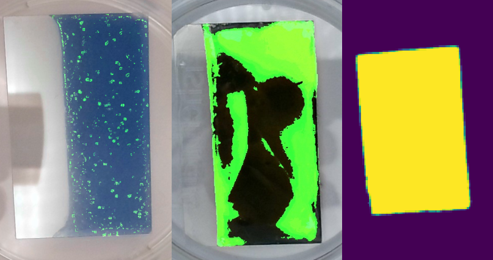

# TUDEL (TU Digital Electrochemistry Lab)

TUDEL is developed by Jack D.V. Carson for the Chemistry Summer Undergraduate Research Program (CSURP) at Tulsa University under an MIT License. 
It is a toolkit for photoanalysis of electrochemical films primarily intended for the synthesis of Perovskite-based solar cells. The primary feature of the
repository is quantitative measurements regarding color, uniformity, and quality of created films.

As of version 0.4, the tools are now available as a GUI that is easy to use. However, due to current issues with the PyInstaller compiler,
it still requires the dependencies covered in the following section. This will hopefully be fixed in the next major version.

## Getting Started
### Dependencies
- Python >3.8
- NumPy
- OpenCV-Python
- Matplotlib
- Tkinter
- PIL

All dependency versions are listed in the `requirements.txt` file and can be easily installed with
`pip install -r requirements.txt` from the source folder in the command line if you have Python adequately installed.

### Download
- Git clone the repository onto your machine
  - If you do not have git installed or do not know how to use it, this will not serve as a tutorial. Download the git terminal [here](https://git-scm.com/). Read more about how to clone a repository [here](https://github.com/git-guides/git-clone)
- `cd` into the new directory with `cd Electrodeposition_analysis`
- Run the application with `python application.py`
  - It is also possible to right click the `application.py` file and `open with > python`

### Usage
As of V0.4, the CLI is deprecated and the GUI is the preferable method for usage. After opening the window,
simply:
1. press Open Image and select a file
2. Choose the type of film you wish to analyze from the new dropdown menu
3. Select your operation from the buttons on the left (calibrate, analyze, dimension), and the results should quickly appear
   1. It is advisable to calibrate the image before usage to ensure brightness and color quality are consistent
4. Save the analyzed image with the Save Image button

## Version History
- V0.4 Graphical User Interface
- V0.3 Documentation and CLI interface
- V0.2 Fixed Sobel edge bug and major refactoring
- V0.1 Initial Commit

## Acknowledgements

A special thanks to Dr. LeBlanc and the LeBlanc research group for mentorship and guidance in the creation of this software 
as well as the CSURP program and the University of Tulsa.